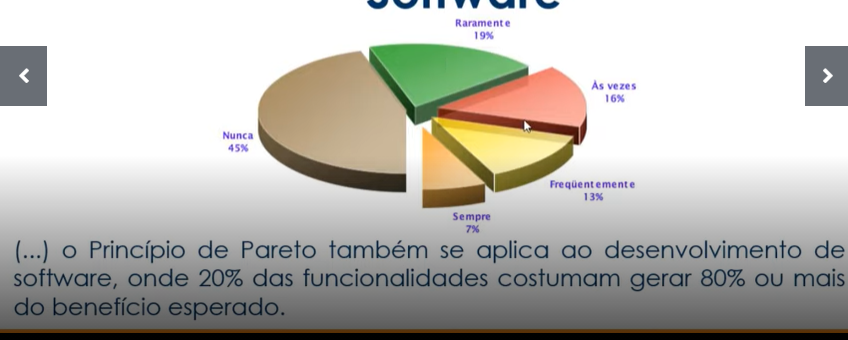
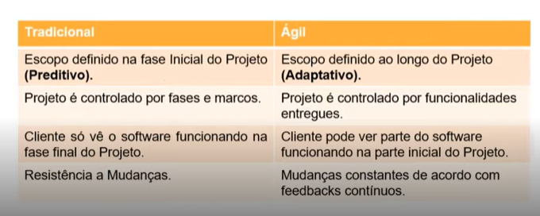
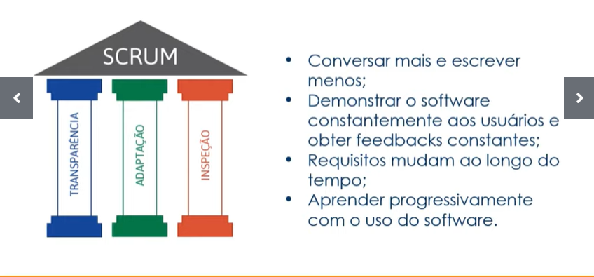
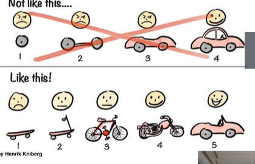

# 

## Introdução ao SCRUM

SCRUM é um método desenvolvido com a finalidade de trazer mais agilidades e um melhor caminho na produção até sua chegada em um  ponto desejado. Para tal são usados processos que tem como finalidade reconhecer os principais requisitos para um objetivo do negócio, os quais serão focados durantes um determinado período de tempo estabelecida. 

Com o estudo dos requisitos planos podem ser traçados para agilizar todo o processo, visto que o Princípio de Pareto, nos mostra que apenas determinadas partes serão utilizadas pela maioria, então se for optado por realizar o desenvolvimento de tal parte primeiramente, dividindo essa parte em que no máximo terão 30 dias.

Diferente do modelo tradicional, que opta por um modelo de produção em cascata, o Scrum se base  em realizar o projeto em ciclos, nos quais cada etapa é planejada e executada com base em um cronograma e um objetivo para aquele ciclo.

Vale ressaltar que ágil é diferente de rápido, a ideia geral não é fazer realizar o projeto no menor tempo possível, mas sim alcança-lo de forma eficiente e que ao mesmo tempo possa ser sujeito a mudanças, por isso busca-se uma simplicidade na sua concepção.

Pilares do Scrum: 

Muitas startup utilizam essa modelo de gestão de projeto, por causa da ideia da produção de um produto mínimo viável(MVP)

## Papeis de cada um do Time

### Production Owner (PO)

- Representa a área de negócio
- Um pessoa
- Define o Backlogo e os seus itens
- Prioriza as funcionalidades de acordo com o valor do negócio 

### Scrum Master (SM)

- Não é gerente de projeto
- Age como facilitador
- Auxilia o PO, assim como o time de DEV
- Treina o time em autogerenciamento e interdisciplinaridade 

### Time de Desenvolvimento

- Responsáveis pelo desenvolvimento do projeto
- Necessariamente não precisam realizar todas as partes do projeto, mas é interessante saber sobre as outras etapas,  como design, frontend, backend e testes.

## Cerimónias do SCRUM

No Scrum há o sprint, que é o  principal evento presente nesse modelo de gestão de projeto, o mesmo ocorre no máximo em 30 dias. Uma sprint é composta por fase a quais são o planejamento, reunião diária, revisão e retrospectiva. Após a finalização de uma sprint se o projeto não estiver concluído uma nova sprint será iniciada. 

No final de um sprint caso desejado pode ser lançado uma release, ou seja o lançamento do produto como uma novo produto ou atualização. Vale ressaltar  que há dois tipos de release: múltiplas squads e a de projeto

## Papéis e Responsabilidades - Product Owner

Representa o profissional que tem uma visão geral do que será desenvolvido,  portanto cabe ao individuo observar se o projeto está seguindo o caminho desejado, mas caso não, o PO como responsável pode cancelar uma sprint caso seja necessária.  O PO deve estar preparado, visto como ele não possui a visão geral do projeto, mas sim ao logo das sprints que o projeto ira se desenvolver, acompanhando o projeto para ver quando uma release realmente se faz necessária.

## Analisando Escopo e Definindo Prioridades

A definição do escopo de um projeto é uma parte prioritária do projeto, por meio da sua definição as sprints podem ser planejadas para que no fim alcancem o objetivo desejado, podemos observar esse conceito na imagem abaixo, na qual em cada release à uma atualização até chegar no ponto previsto.

## Productor Backlog

Cada projeto possui o seu próprio backlog, ele é composto por  épicos e estórias. Épicos são incrementos sem muitos detalhamentos que servem para nortear o caminho, enquanto as estórias são um detalhamentos dos épicos, que normalmente se dividem em várias etapas na qual é escrito quais serão as regras de negócio do projeto. Após a definição das estórias elas serão dividida em tarefas, que são um conjunto de atividades que o time de desenvolvimento desempenha para a entregar a estória.  

## Conceitos e Planejamento de Tarefas

Em um projeto existem os critérios de aceite que servem como âncora para que o time esteja ciente do caminho desejado, ou seja, qual o objetivo que querem atingir.  

Para mensurar o esforço e complexidade das tarefas ou épicos do cliente, pode ser utilizado uma ferramenta como o planning poker, além do seu uso padrão ela também seve como um meio para facilitar a interação do time.

O stakeholder é uma pessoa ou grupo que legitima as ações de uma organização e que te um papel direto ou indireto na gestão e resultados dessa mesma organização. 

## Rotinas Time Ágil 

As reuniões diárias devem ocorrer no máximo em até 15 minutos, na qual o time de desenvolvimento deve responder as questões coo o que fiz ontem, o que farei hoje e se tenho alguma dificuldade. A retrospectiva acontece apenas uma vez na sprint, geralmente intercalando em com ou sem o PO, para o temas que serão discutido na sprint como um todo. 

Refinamento é um cerimónia não oficial do Scrum, é usando como a finalidade de tirar qualquer dúvida referente, para tornar o planejamento mais claro.  Na review o time de desenvolvimento apresenta o que foi realizado na sprint passada validando com o PO e PM.

